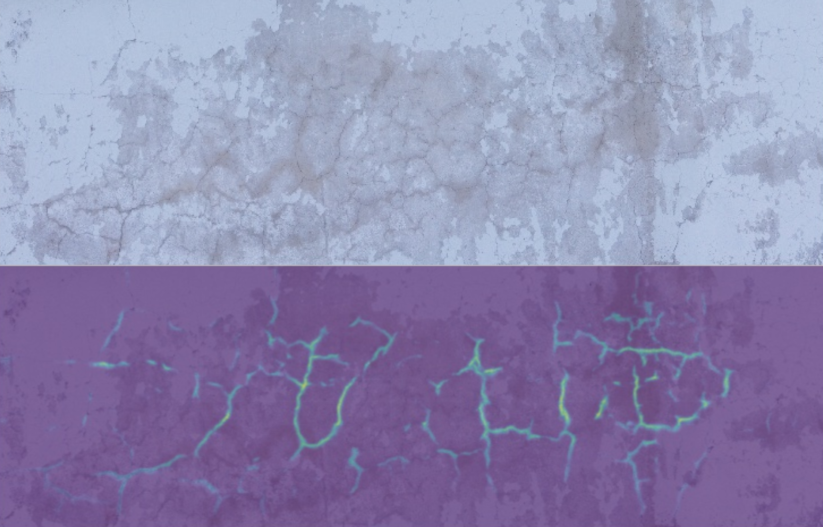

# crack_segmentation
this repository contains code and dataset for my experiment in crack segmentation using the UNet archiecture
the dataset is merged from 5 different crack datasets which contain images with corresponding masks.
there're also around 500 images labeled by me. 

#sample result

# how to insall library
conda create --name crack
conda install -c fastai fastai 
conda install -c conda-forge opencv 

# how to evaluate the result
python evaluate.py  -in_dir PATH_TO_IMAGE_FOLDER model_path PATH_TO_THE_MODEL -out_dir PATH_TO_OUTPUT_DIRECTORY

#how to train the model
step 1. download the merged dataset from the link
step 2. run the training code
python train.py -data_dir PATH_TO_THE_DATASET_FOLDER -model_path PATH_TO_OUTPUT_MODEL

# Note: please cite the corresponding papers when using these datasets.

CRACK500:
>@inproceedings{zhang2016road,
  title={Road crack detection using deep convolutional neural network},
  author={Zhang, Lei and Yang, Fan and Zhang, Yimin Daniel and Zhu, Ying Julie},
  booktitle={Image Processing (ICIP), 2016 IEEE International Conference on},
  pages={3708--3712},
  year={2016},
  organization={IEEE}
}' .

>@article{yang2019feature,
  title={Feature Pyramid and Hierarchical Boosting Network for Pavement Crack Detection},
  author={Yang, Fan and Zhang, Lei and Yu, Sijia and Prokhorov, Danil and Mei, Xue and Ling, Haibin},
  journal={arXiv preprint arXiv:1901.06340},
  year={2019}
}

GAPs384: 
>@inproceedings{eisenbach2017how,
  title={How to Get Pavement Distress Detection Ready for Deep Learning? A Systematic Approach.},
  author={Eisenbach, Markus and Stricker, Ronny and Seichter, Daniel and Amende, Karl and Debes, Klaus
          and Sesselmann, Maximilian and Ebersbach, Dirk and Stoeckert, Ulrike
          and Gross, Horst-Michael},
  booktitle={International Joint Conference on Neural Networks (IJCNN)},
  pages={2039--2047},
  year={2017}
}

CFD: 
>@article{shi2016automatic,
  title={Automatic road crack detection using random structured forests},
  author={Shi, Yong and Cui, Limeng and Qi, Zhiquan and Meng, Fan and Chen, Zhensong},
  journal={IEEE Transactions on Intelligent Transportation Systems},
  volume={17},
  number={12},
  pages={3434--3445},
  year={2016},
  publisher={IEEE}
}

AEL: 
>@article{amhaz2016automatic,
  title={Automatic Crack Detection on Two-Dimensional Pavement Images: An Algorithm Based on Minimal Path Selection.},
  author={Amhaz, Rabih and Chambon, Sylvie and Idier, J{\'e}r{\^o}me and Baltazart, Vincent}
}

cracktree200: 
>@article{zou2012cracktree,
  title={CrackTree: Automatic crack detection from pavement images},
  author={Zou, Qin and Cao, Yu and Li, Qingquan and Mao, Qingzhou and Wang, Song},
  journal={Pattern Recognition Letters},
  volume={33},
  number={3},
  pages={227--238},
  year={2012},
  publisher={Elsevier}
}

>https://github.com/alexdonchuk/cracks_segmentation_dataset

>https://github.com/yhlleo/DeepCrack

>https://github.com/ccny-ros-pkg/concreteIn_inpection_VGGF