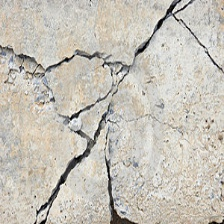
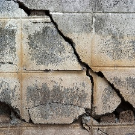
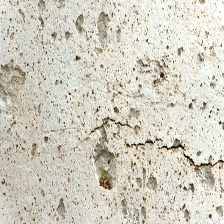
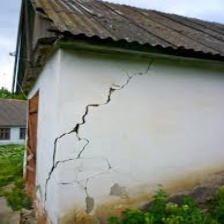

# crack_segmentation
This repository contains code and dataset for the task crack segmentation using two architectures UNet_VGG16, UNet_Resnet and DenseNet-Tiramusu

# segmentation dataset
From my knowledge, the dataset used in the project is the largest crack segmentation dataset so far. 
It contains around 11.200 images which are merged from 12 available crack segmentation dataset.
The name prefix of each image is assigned to the corresponding dataset that the image belong to. 
There're also images which contain no crack, which could be filtered out by the pattern "noncrack*"
All the images in the dataset are resized to the size of (448, 448).

the two folders images and masks contain all the images
the two folders train and test contain training and testing images splitted from the two above folder. 
the splitting is stratified so that the proportion of each dataset in the train and test folder are similar

If you want access to the original datasets before they are merged, please contact me through email: khanhhh89@gmail.com


***
# How to insall library
```python
conda create --name crack
conda install -c fastai fastai 
conda install -c conda-forge opencv 
```

***
# how to evaluate the model on the test images
- download the pre-trained model unet_vgg16 or unet_resnet_101.
- put the downloaded model under the folder ./models
- run the code
```pythonstub
python evaluate_unet.py  -in_dir ./test_images model_path ./model_resnet_101.pt -out_dir ./test_result
```

***
# how are the test images collected?
To evaluate the robustness of the crack model in different contexts, I tried to think of several noisy condition that could happen in practice to test the model
there could be the following situation

- pure crack: these are  ideal cases where only crack are in the images.



- like crack: pictures of this type contains details that look like crack 



- crack with moss: there're moss on crack. These cases occur a lot in practice.


- crack with noise: the background (wall, concrete) are lumpy  



- crack in large context: the context is large and diverse. For example, the whole house or street with people



I am very welcome to further idea from you. please drop me an email at khanhhh89@gmail.com if you think of other cases

# how to train the model
- step 1. download the dataset from [the link](https://drive.google.com/open?id=1xrOqv0-3uMHjZyEUrerOYiYXW_E8SUMP)
- step 2. run the training code
- step 3: 
```python 
python train.py -data_dir PATH_TO_THE_DATASET_FOLDER -model_dir PATH_TO_MODEL_DIRECTORY -model_type resnet_101
```

***

# Note: please cite the corresponding papers when using these datasets.

CRACK500:
>@inproceedings{zhang2016road,
  title={Road crack detection using deep convolutional neural network},
  author={Zhang, Lei and Yang, Fan and Zhang, Yimin Daniel and Zhu, Ying Julie},
  booktitle={Image Processing (ICIP), 2016 IEEE International Conference on},
  pages={3708--3712},
  year={2016},
  organization={IEEE}
}' .

>@article{yang2019feature,
  title={Feature Pyramid and Hierarchical Boosting Network for Pavement Crack Detection},
  author={Yang, Fan and Zhang, Lei and Yu, Sijia and Prokhorov, Danil and Mei, Xue and Ling, Haibin},
  journal={arXiv preprint arXiv:1901.06340},
  year={2019}
}

GAPs384: 
>@inproceedings{eisenbach2017how,
  title={How to Get Pavement Distress Detection Ready for Deep Learning? A Systematic Approach.},
  author={Eisenbach, Markus and Stricker, Ronny and Seichter, Daniel and Amende, Karl and Debes, Klaus
          and Sesselmann, Maximilian and Ebersbach, Dirk and Stoeckert, Ulrike
          and Gross, Horst-Michael},
  booktitle={International Joint Conference on Neural Networks (IJCNN)},
  pages={2039--2047},
  year={2017}
}

CFD: 
>@article{shi2016automatic,
  title={Automatic road crack detection using random structured forests},
  author={Shi, Yong and Cui, Limeng and Qi, Zhiquan and Meng, Fan and Chen, Zhensong},
  journal={IEEE Transactions on Intelligent Transportation Systems},
  volume={17},
  number={12},
  pages={3434--3445},
  year={2016},
  publisher={IEEE}
}

AEL: 
>@article{amhaz2016automatic,
  title={Automatic Crack Detection on Two-Dimensional Pavement Images: An Algorithm Based on Minimal Path Selection.},
  author={Amhaz, Rabih and Chambon, Sylvie and Idier, J{\'e}r{\^o}me and Baltazart, Vincent}
}

cracktree200: 
>@article{zou2012cracktree,
  title={CrackTree: Automatic crack detection from pavement images},
  author={Zou, Qin and Cao, Yu and Li, Qingquan and Mao, Qingzhou and Wang, Song},
  journal={Pattern Recognition Letters},
  volume={33},
  number={3},
  pages={227--238},
  year={2012},
  publisher={Elsevier}
}

>https://github.com/alexdonchuk/cracks_segmentation_dataset

>https://github.com/yhlleo/DeepCrack

>https://github.com/ccny-ros-pkg/concreteIn_inpection_VGGF